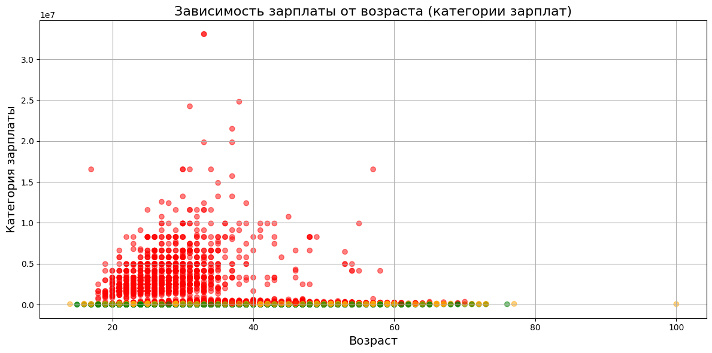
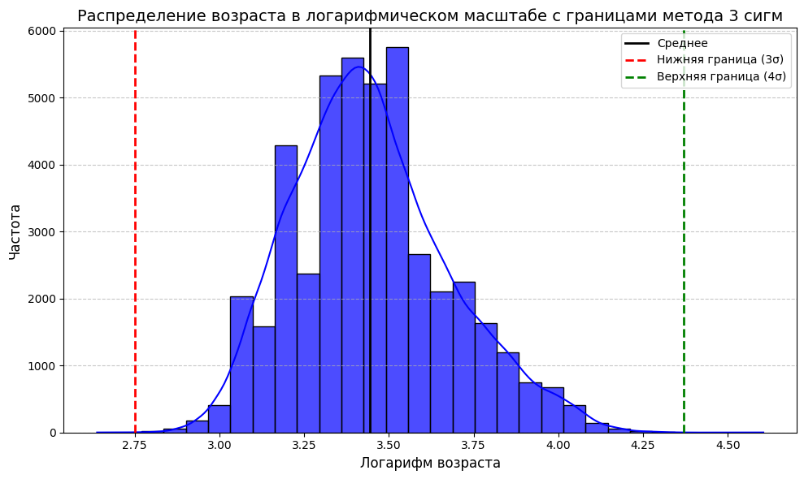

# MEPHI_Task2_Headhunter

# 📊 Проект: Анализ резюме из HeadHunter

## 📋 Описание
Этот проект предназначен для анализа резюме, полученных с платформы HeadHunter. Основной задачей является исследование структуры данных, проведение анализа и визуализация результатов с использованием Python.

## 🛠 Используемые технологии
- **Python**: язык программирования для анализа данных
- **Библиотеки**:
  - `pandas` для работы с данными
  - `seaborn` для визуализации
  - `numpy` для математических операций

## 📂 Структура проекта
- `HH_Project.ipynb`: основной файл проекта.
-  images -  графики

## 🧩 Основные этапы работы
1. Загрузка данных.
2. Первичный анализ структуры данных.
3. Визуализация ключевых метрик.

## 🌟 Результаты
Проект помогает выявить ключевые закономерности в данных о резюме, что может быть полезно для HR-анализа и улучшения процесса подбора персонала. Так же такой анализ и подготовка данных могут быть полезны для создания рекоммендательной системы, предсказывающей уровень зарплат кандидатов, не указавших зп ожидания в своих резюме, эти данные могут быть полезны для работодателей при поиске кандидатов.

---

# 📊 Project: HeadHunter Resume Analysis

## 📋 Description
This project analyzes resumes from the HeadHunter platform using Python for data processing and visualization.

## 🛠 Technologies
- **Python**
- **Libraries**:
  - `pandas`
  - `seaborn`
  - `numpy`

## 📂 Project Structure
- `HH_Project.ipynb`: main notebook file.
- `images/`: graphs

## 🌟 Results
The project identifies patterns in resume data, supporting HR analysis and recruitment improvement.

